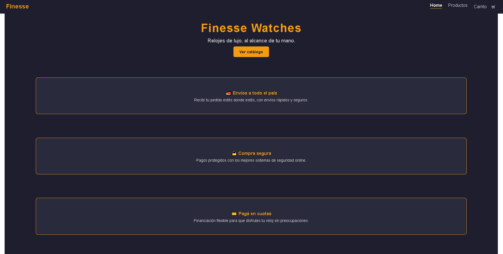
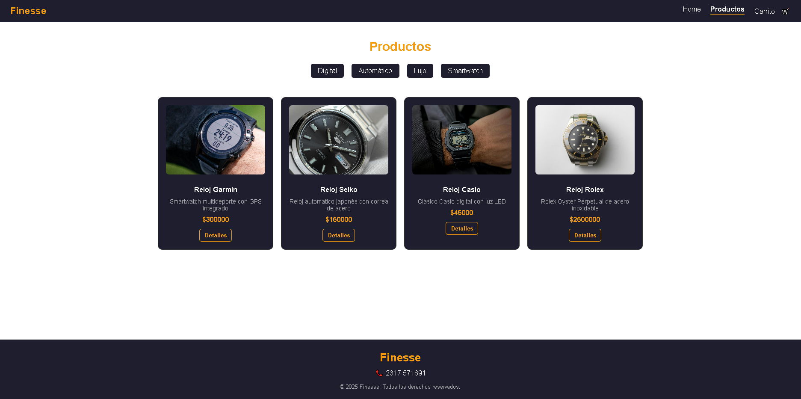
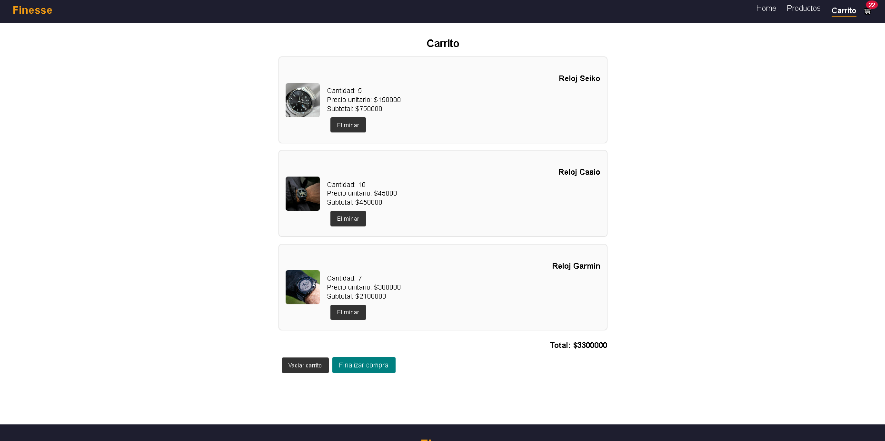
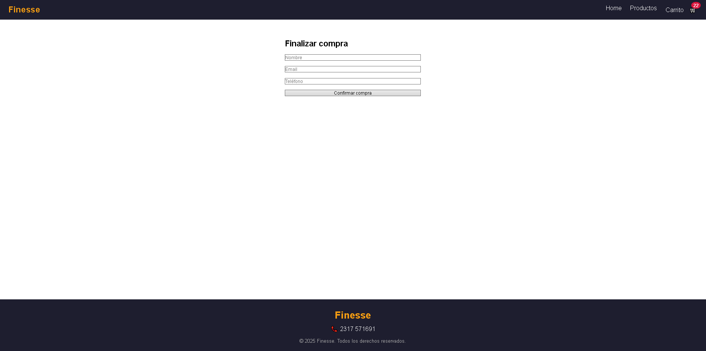

# 🕒 Finesse Watches - Proyecto Final React

SPA de e-commerce desarrollada con **React + Vite + Firebase**, como entrega final del curso de React en CoderHouse.

## 🚀 Características principales
- Catálogo de productos cargado dinámicamente desde **Firestore**.
- Detalle de producto con imagen, descripción, precio y stock.
- Carrito de compras con **Context API**:
  - Agregar, eliminar y vaciar productos.
  - Cálculo automático de subtotales y total.
  - Validación de stock (no se puede superar el máximo disponible).
- Checkout con formulario:
  - Datos del comprador (nombre, email, teléfono).
  - Generación de orden en **Firestore** (`orders`).
  - Visualización del **ID de la orden** al confirmar.
- Renderizado condicional:
  - **Loaders** al cargar productos.
  - Mensajes de *carrito vacío* y *producto sin stock*.
- Navegación SPA con **React Router v6** (sin recargas de página).

## 📂 Rutas principales
- `/` → Home (presentación de la tienda).
- `/productos` → Catálogo completo.
- `/categoria/:catId` → Productos filtrados por categoría.
- `/productos/:id` → Detalle de un producto.
- `/carrito` → Carrito de compras.
- `/checkout` → Checkout y confirmación de orden.

## 🛠️ Tecnologías utilizadas
- **React + Vite**
- **React Router v6**
- **Firebase / Firestore**
- **CSS**

## ⚙️ Instalación y ejecución

Clonar el repositorio y ejecutar:

```bash
git clone https://github.com/DanteBuenoWorkspace/React-ProyectoFinal-Bueno.git
cd React-ProyectoFinal-Bueno
npm install
npm run dev

## 📸 Capturas

### 🏠 Home


### 🛍️ Productos


### 🛒 Carrito


### ✅ Checkout

